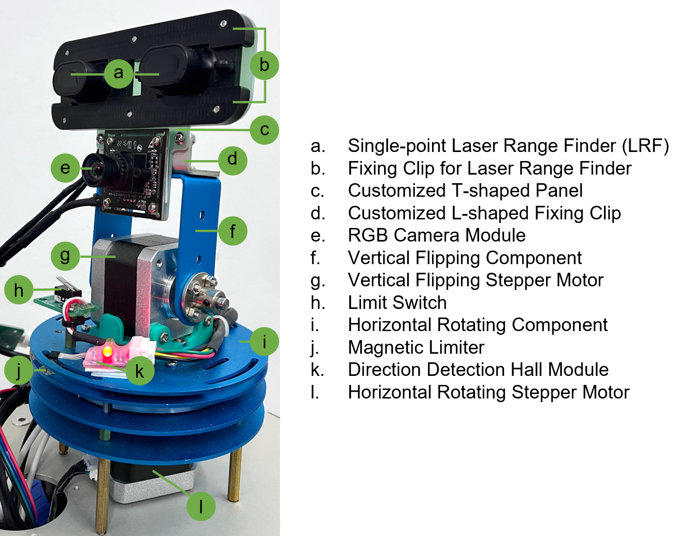
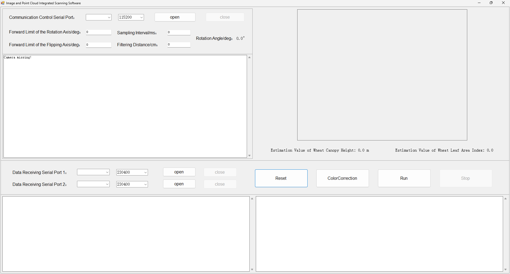

# A Low-Cost RGB Image and Point Cloud Integrated Scanning System for Wheat Phenotyping

This repository contains the official source code and supporting design files for our paper:

**A Low-Cost RGB Image and Point Cloud Integrated Scanning System for Wheat Phenotyping**

## Introduction

The repository provides the hardware design drawings, system-calibration scripts, and operating-software source code for the RGB image and point cloud integrated scanning system (IPCISS).

## Hardware Design

The `hardware_design` directory contains the following mechanical and structural design drawings:

- `CircularBase（1pcs）.dwg`: Design drawing of the circular sensor base.
- `CustomizedL-shapedFixingClip（1pcs）.dwg`: Design drawing of the customized L-shaped support module.
- `CustomizedT-shapedPanel（1pcs）.dwg`: Design drawing of the customized T-shaped mounting panel.
- `FixingClipForLaserRangeFinder（2pcs）.dwg`: Design drawing of the fixing clips used with the T-shaped mounting panel to secure two single-point laser range finder (LRF) modules.
- `CoreSensorIntegrationUnit.DWG`: Overall structural design drawing of the IPCISS core sensor integration unit.

*Structural composition of the IPCISS core sensor unit.*

## System Calibration

The `system_calibration` directory contains the following calibration scripts and supporting files:

- `ColorCorrection/`: Contains `ColorCorrection.py`, which performs RGB image color correction using the standard reference-color file `colortrue.xlsx`.
- `CameraIntrinsicParameterK.py`: Calculates the camera intrinsic parameters using Zhang's camera calibration method.
- `RGBNIRHomographyH.py`: Estimates the homography matrix between the RGB and near-infrared (NIR) cameras from paired images.
- `LRF2RGBextrinsicParameterM.py`: Estimates the extrinsic transformation matrix between the LRF and RGB camera.

## Software

The `software` directory contains the source code for the IPCISS operating software. The core implementation is provided in `mainform.cs`.

### Operating Procedure

1. Connect the laptop to IPCISS using the serial cable.
2. Launch the operating software and open the corresponding serial port.
3. Click **Reset** to return the sensor unit to its initial position.
4. Click **ColorCorrection** to acquire an image containing the color calibration chart and calculate the color-correction matrix.
5. Click **Run** to start scanning.
6. Click **Stop** to terminate the scan. The system then outputs an RGB-colored 3D point cloud.

*IPCISS operating-software interface.*
